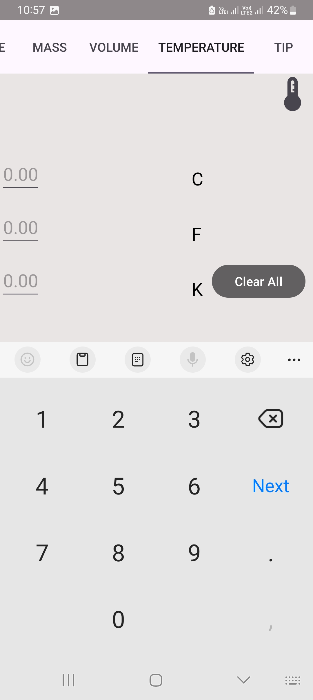
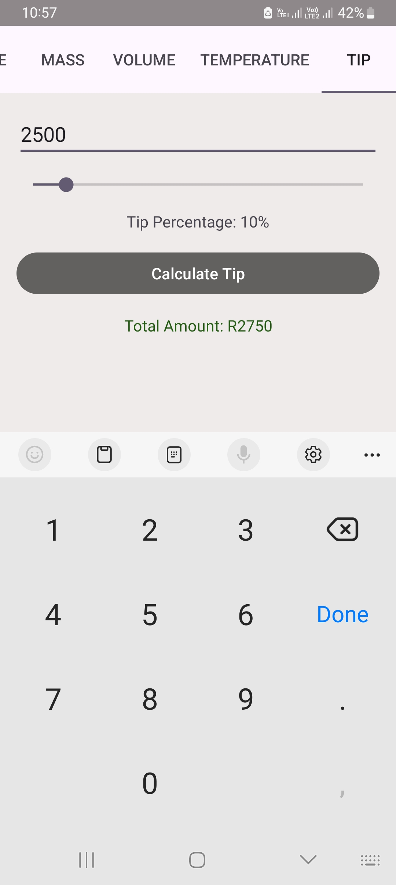
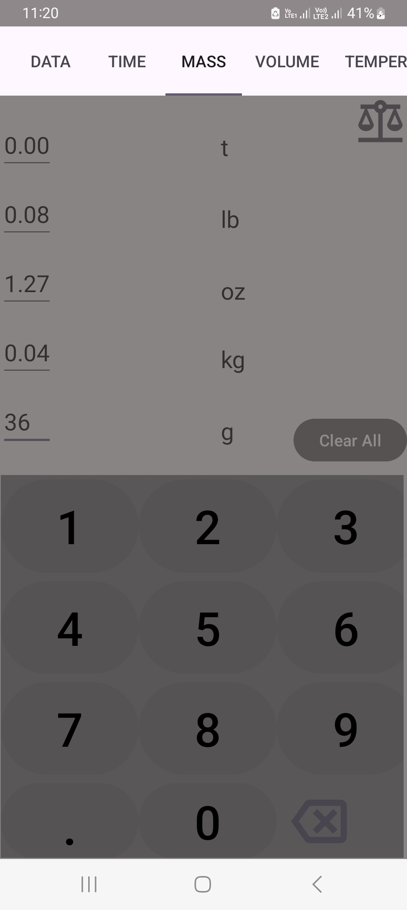
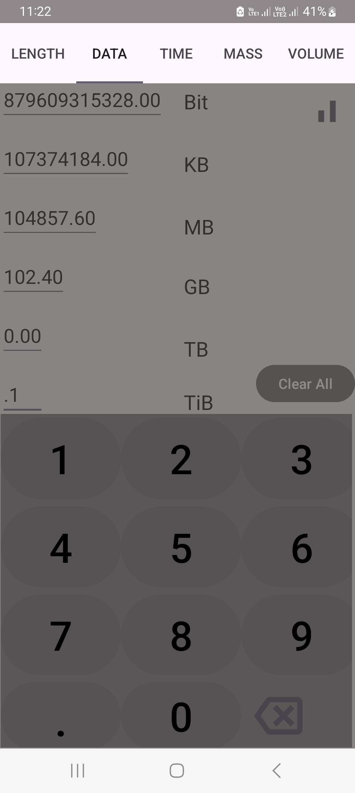

# OIBSIP
Oasis Infobyte internship ( Android Application Development)

1.Unit Converter Application

2.To-Do App

3.Quiz Application

## Converter

This app allows users to convert various units of measurement, including data,length,mass,volume and temperature etc. It provides a user-friendly interface and supports easy input through a custom numeric keyboard.

##  Screeenshots

 

### Features

Length Conversion: Convert between meters, millimeters, centimeters, kilometers, inches, and feet. 

Temperature Conversion: Convert between Celsius, Fahrenheit, and Kelvin. 

Intuitive numeric keyboard for easy data entry 

And many more

### Getting Started Follow these steps to set up and run the Unit Converter App: 

##### Prerequisites 

Android Studio installed on your machine. Android device or emulator for testing or use USB to connect your cellphone to the pc . 

##### Installation

Clone the repository to your local machine: 

bash Copy code: "git clone https://github.com/Bongani-4/OIBSIP.git"

Open the project in Android Studio. Build and run the app on your Android device or emulator.

Usage: 

1. Launch the B-Unit Converter App on your Android device.
2.  Use the length conversion tab or temperature conversion tab based on your requirement.
3.   Enter numeric values using the custom numeric keyboard. View the converted values in real-time.
4.   Use the "Clear All" button to reset all input fields.

See the LICENSE file for License details.
